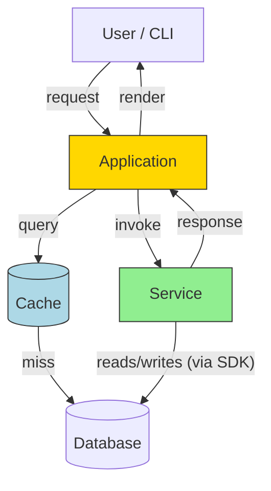
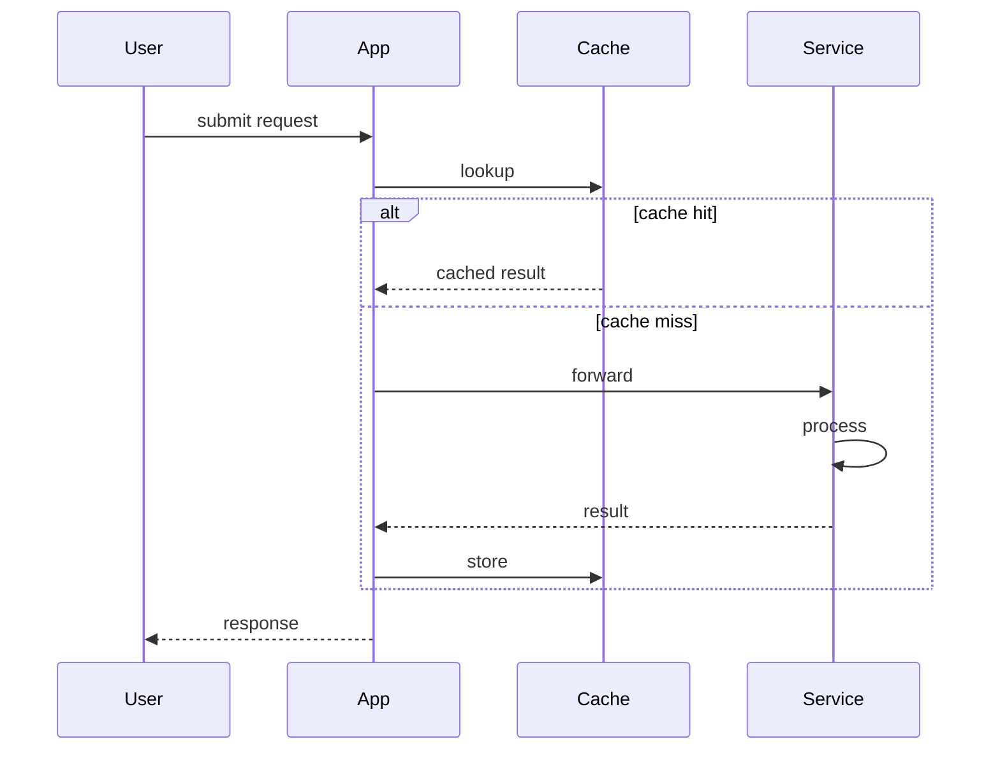

# Test Design Doc: Sample Feature Integration

> **Area**: testing
> **Status**: In Review
> **Author**: Test User
> **Reviewers**: @alice, @bob
> **Last Updated**: 2026-05-19

This document exists to exercise the **Rich Diff Comments for GitHub** extension. It deliberately includes every markdown construct the extension's line-mapping has to handle — tables, mermaid diagrams, code blocks, nested lists, blockquotes, task lists, raw HTML, and so on.

The revision history at the bottom tracks each round of review feedback.

## Table of Contents

- [Overview](#overview)
- [Architecture](#architecture)
  - [Architecture Diagram](#architecture-diagram)
  - [Sequence Diagram](#sequence-diagram)
  - [Impact Analysis](#impact-analysis)
- [Implementation Phases](#implementation-phases)
  - [Phase 1: Foundation](#phase-1-foundation)
  - [Phase 2: Smart Routing](#phase-2-smart-routing)
  - [Phase 3: CLI and Docs](#phase-3-cli-and-docs)
  - [Phase 4: Telemetry](#phase-4-telemetry)
- [Task List](#task-list)
- [Risks](#risks)
- [Code Samples](#code-samples)
- [Nested Lists](#nested-lists)
- [HTML / Edge Cases](#html--edge-cases)
- [References](#references)
- [Change Log](#change-log)

---

## Overview

This is the **overview paragraph**. It contains _emphasis_, `inline code`, and a [link to the docs](https://example.com/docs). The goal is to have several paragraphs in a row so the text-matcher has to handle ordering across small edits.

A second paragraph follows directly. Reviewers should be able to:

1. Comment on this entire paragraph from rich diff
2. Comment on individual list items (including deeply nested ones)
3. Reply to existing threads inline without leaving the rich-diff view
4. Resolve and unresolve threads
5. Drag-select a range across multiple paragraphs to open a multi-line review comment
6. Edit and delete their own comments via the `⋯` menu

> A blockquote here, with **bold** and `inline code`. Multiple lines:
> Line two of the quote, now slightly longer to test text re-matching.
> Line three with a [link](https://example.com) and a trailing footnote.
> Line four, newly added in this revision.

A short paragraph after the blockquote, used as a target for "comment on line right after a blockquote" tests. A second sentence is appended to grow the block.

---

## Architecture

### Architecture Diagram



**Legend**: 🟢 New | 🟡 Modified | 🔵 Cached

### Sequence Diagram



### Impact Analysis

| Component | Change Type | Description |
|-----------|-------------|-------------|
| `Application.start` | Modified | Initializes new service connection and cache client |
| `Service.handle` | New | Routes requests to backends based on type |
| `Service.validate` | New | Pre-flight checks before dispatch |
| `Cache.lookup` | New | LRU cache in front of the service |
| `Database.schema` | Modified | Adds `requested_at`, `processed_at`, and `cache_hit` columns |
| CLI (`app/__main__.py`) | Modified | Adds `--service-url`, `--cache-size`, `--strict` flags |
| `pyproject.toml` | Modified | Bump min version of `sdk-lib`; add `cachetools` dep |
| Telemetry | New | Emit counters for backend selection and cache hit rate |
| Tests | New | Unit + integration tests for routing and cache |

---

## Implementation Phases

### Phase 1: Foundation

**Goal**: Get the new service plumbing in place without changing observable behavior.

**Approach**: Add `Service` class with `accepts()` and `handle()` methods. Wire it into `Application.start` but only activate when an opt-in kwarg is set. Default path remains unchanged.

**Dependencies**: none.

#### Tasks

1. **Create the `Service` class**
   - File: `src/app/service.py`
   - Methods: `__init__`, `accepts(request) -> bool`, `validate(request) -> None`, `handle(request) -> Response`
   - Acceptance criteria:
     - [x] `Service` instance is constructible with default args
     - [x] `accepts()` returns `True` for supported request types
     - [ ] `accepts()` returns `False` for unsupported types
     - [ ] `validate()` raises on malformed payloads
     - [ ] `handle()` returns a valid `Response` for an accepted request

2. **Wire into the constructor**
   - File: `src/app/_application.py`
   - Add `service_url: str | None = None` kwarg
   - When set, instantiate `Service` and register it at position 0
   - Acceptance criteria:
     - [ ] `Application(service_url="...")` activates the service
     - [ ] `Application()` (no kwargs) preserves existing behavior

#### Tests

- [ ] Unit: `accepts()` for all supported types
- [ ] Unit: `handle()` mock returns a valid response
- [ ] Integration: end-to-end call via `Application(service_url=...)`

---

### Phase 2: Smart Routing

**Goal**: Route requests to the right backend based on type, with cache fast-path.

**Approach**: Add a routing table, a `_resolve_backend()` helper, and an LRU cache wrapper around `handle()`. Cache is keyed by request hash and capped at `cache_size` entries (default 1024).

**Dependencies**: Phase 1 complete.

#### Tasks

1. **Routing table**
   - File: `src/app/service.py`
   - Add `_BACKEND_MAP: dict[str, str]` constant
   - Add `_resolve_backend(request)` returning `(backend_name, modality)`
   - Acceptance criteria:
     - [ ] Maps each supported type to its backend
     - [ ] Returns a default backend for unknown types
     - [ ] Logs a warning on fallback

2. **Wire into `handle()`**
   - Acceptance criteria:
     - [ ] `handle()` consults the routing table for every request
     - [ ] Backend choice is observable via `Response.metadata['backend']`

#### Tests

- [ ] Unit: each supported type routes to the expected backend
- [ ] Unit: unknown type → fallback + warning logged
- [ ] Unit: repeated request hits the cache on the second call
- [ ] Unit: cache eviction at `cache_size + 1` entries

---

### Phase 3: CLI and Docs

**Goal**: Surface the new options on the CLI; update the README.

**Approach**: Add argparse flags; document examples.

**Dependencies**: Phases 1 and 2.

#### Tasks

1. **CLI flags**
   - File: `src/app/__main__.py`
   - Add `--service-url` (str), `--cache-size` (int, default 1024), and `--strict` (store_true)
   - Acceptance criteria:
     - [ ] `app run --service-url "..."` activates the service
     - [ ] `app run --cache-size 0` disables the cache
     - [ ] `app run --strict` rejects unknown types

2. **README**
   - Add a "Service Integration" section after the existing "Quick Start"
   - Acceptance criteria:
     - [ ] Example shows `--service-url` and `--cache-size` usage
     - [ ] Output sample matches what the service returns
     - [ ] Cache hit-rate snippet included

---

### Phase 4: Telemetry

**Goal**: Emit metrics for backend selection and cache effectiveness so operators can tune `--cache-size` and spot routing regressions.

**Approach**: Wrap `Service.handle()` and `Cache.lookup()` in lightweight counters using the existing `metrics` module. No new dependencies.

**Dependencies**: Phases 1–3.

#### Tasks

1. **Counters**
   - File: `src/app/service.py`, `src/app/cache.py`
   - Add `metrics.increment("service.backend.<name>")` per dispatch
   - Add `metrics.increment("cache.hit")` / `metrics.increment("cache.miss")`
   - Acceptance criteria:
     - [ ] Counters fire on every relevant code path
     - [ ] Counter names match the existing `metrics` naming convention

2. **Dashboard**
   - Add a Grafana panel JSON snippet to `docs/dashboards/service.json`
   - Acceptance criteria:
     - [ ] Panel shows backend distribution and cache hit-rate

#### Tests

- [ ] Unit: counter increments observed via the `metrics` test double
- [ ] Smoke: dashboard JSON parses

---

## Task List

```yaml
tasks:
  - id: "1.1"
    phase: 1
    title: "Create Service class"
    files:
      - path: "src/app/service.py"
        action: "create"
    dependencies: []
    acceptance_criteria:
      - "Service is constructible"
      - "accepts() returns True for supported types"

  - id: "1.2"
    phase: 1
    title: "Wire into Application"
    files:
      - path: "src/app/_application.py"
        action: "modify"
    dependencies: ["1.1"]
    acceptance_criteria:
      - "Application(service_url=...) activates the service"
      - "Default constructor preserves existing behavior"

  - id: "2.1"
    phase: 2
    title: "Add routing table"
    files:
      - path: "src/app/service.py"
        action: "modify"
    dependencies: ["1.2"]
    acceptance_criteria:
      - "Maps supported types to backends"
      - "Returns a fallback for unknown types"

  - id: "3.1"
    phase: 3
    title: "Add CLI flags"
    files:
      - path: "src/app/__main__.py"
        action: "modify"
    dependencies: ["2.1"]
    acceptance_criteria:
      - "--service-url accepted"
      - "--cache-size accepted (default 1024)"
      - "--strict rejects unknown types"

  - id: "4.1"
    phase: 4
    title: "Add telemetry counters"
    files:
      - path: "src/app/service.py"
        action: "modify"
      - path: "src/app/cache.py"
        action: "modify"
    dependencies: ["3.1"]
    acceptance_criteria:
      - "Per-backend counter fires on dispatch"
      - "Cache hit/miss counters fire on lookup"
```

---

## Risks

| Risk | Likelihood | Impact | Mitigation |
|------|------------|--------|------------|
| Service URL changes upstream | Medium | Medium | Pin version; capture URL in config |
| Routing table drift | Low | High | Cover with unit tests per supported type |
| Backward compatibility regressions | Low | High | Default kwargs unchanged; add regression tests |
| Cache poisoning via shared key | Low | High | Include caller identity in cache key |
| Memory pressure from oversized cache | Medium | Medium | LRU eviction; expose `--cache-size`; document tuning |
| CLI flag naming conflict | Low | Low | Prefix with `--service-` / `--cache-` |
| Network flakiness in integration tests | Medium | Low | Mark slow tests `@pytest.mark.slow`; skip by default |

---

## Code Samples

### Python: minimal usage

```python
from app import Application

app = Application(
    service_url="https://example.com/svc",
    cache_size=1024,
)
result = app.handle({"type": "ping", "payload": "hello"})
print(result.body)
# → "pong"
print(result.metadata["backend"], result.metadata["cache_hit"])
# → "primary" False
```

### Python: with strict mode

```python
from app import Application, UnknownRequestType

app = Application(service_url="https://example.com/svc", strict=True)

try:
    app.handle({"type": "unknown", "payload": ""})
except UnknownRequestType as e:
    print(f"rejected: {e}")
```

### Shell

```bash
# Activate the service
app run --service-url "https://example.com/svc" sample.json

# Tune the cache size (0 disables the cache entirely)
app run --service-url "https://example.com/svc" --cache-size 4096 sample.json

# Strict mode rejects unknown types
app run --service-url "https://example.com/svc" --strict sample.json
```

### Inline language fragments

A snippet of `JavaScript` mixed into prose: `const x = arr.map((n) => n * 2);`. A snippet of SQL: `SELECT id, name FROM users WHERE active = 1 ORDER BY name;`. Both should remain commentable without breaking the surrounding paragraph.

---

## Nested Lists

A taste of nested-list line mapping:

- Top-level item one
  - Nested item A
  - Nested item B (revised)
    - Deeply nested item
    - Deeply nested item two — newly added
- Top-level item two
  - Nested item C
  - Nested item D — newly added
- Top-level item three
- Top-level item four — newly added

Numbered:

1. First
   1. Sub-first
   2. Sub-second
2. Second
3. Third

Task list:

- [x] Initial design reviewed
- [x] Phase 1 implemented
- [x] Phase 2 tests added
- [ ] Phase 3 CLI flags wired
- [ ] Phase 4 telemetry counters in place
- [ ] CLI documented
- [ ] Release notes drafted

---

## HTML / Edge Cases

Some markdown documents embed raw HTML for collapsible sections:

<details>
<summary>Click to expand sample output</summary>

```
status: ok
backend: primary
cache_hit: false
latency_ms: 42
requested_at: 2026-05-19T08:14:02Z
processed_at: 2026-05-19T08:14:02.042Z
```

</details>

A paragraph after the `<details>` block — used as a target for "comment after raw HTML" tests.

A horizontal rule:

---

A paragraph after the horizontal rule.

---

## References

- [GitHub PR Review API](https://docs.github.com/en/rest/pulls/comments)
- [Mermaid syntax](https://mermaid.js.org/intro/)
- [LRU cache patterns](https://docs.python.org/3/library/functools.html#functools.lru_cache)
- Internal design wiki: [link](https://example.com/wiki/design)
- Internal telemetry guide: [link](https://example.com/wiki/telemetry)

## Change Log

| Date | Author | Change Summary |
|------|--------|----------------|
| 2026-05-12 | Test User | Initial test document for the rich-diff comments extension |
| 2026-05-19 | Test User | Added Phase 4 (telemetry), cache layer, sequence diagram alt path, expanded risks and tasks |
